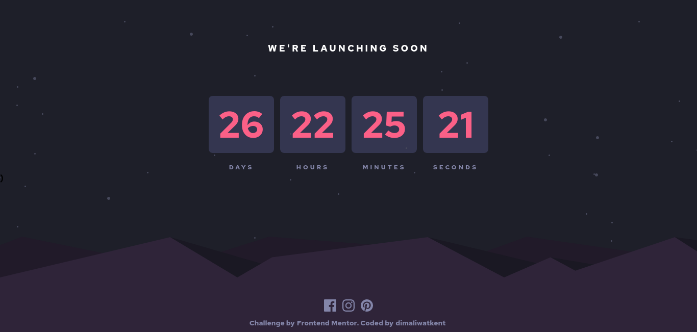

# Frontend Mentor - Launch countdown timer solution

This is a solution to the [Launch countdown timer challenge on Frontend Mentor](https://www.frontendmentor.io/challenges/launch-countdown-timer-N0XkGfyz-). Frontend Mentor challenges help you improve your coding skills by building realistic projects.

## Table of contents

- [Overview](#overview)
  - [The challenge](#the-challenge)
  - [Screenshot](#screenshot)
  - [Links](#links)
- [My process](#my-process)
  - [Built with](#built-with)
  - [What I learned](#what-i-learned)
  - [Continued development](#continued-development)
  - [Useful resources](#useful-resources)
- [Author](#author)
- [Acknowledgments](#acknowledgments)

## Overview

### The challenge

Users should be able to:

- See hover states for all interactive elements on the page
- See a live countdown timer that ticks down every second (start the count at 14 days)
- **Bonus**: When a number changes, make the card flip from the middle

### Screenshot

### Links

- Solution URL: [GitHub](https://github.com/dimaliwatkent/countdown-timer.git)
- Live Site URL: [Countdown Timer](https://countdown-timer-197e4.web.app)

## My Process

### Built with

- Vite
- React
- Tailwind

### What I Learned

- How to use the date function in JavaScript
- How to make a countdown using the date

### Continued Development

### Useful Resources

## Author

- Frontend Mentor - [@dimaliwatkent](https://www.frontendmentor.io/profile/dimaliwatkent)

## Acknowledgments
